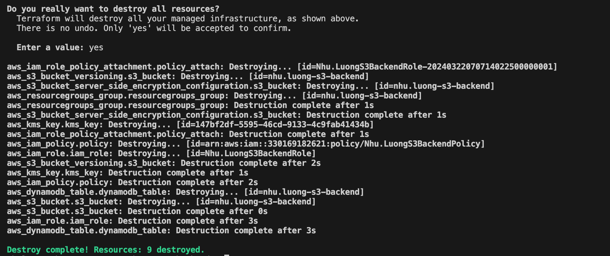

# Auto deploy an  with Terraform EKS cluster, ECR Repositories
In this pratices, we will be automating rovision the infrastructure application deployed on EKS cluster, ECR Repositories ...

Some of the goals of this pratices:

- Create S3 bucket to store state for main Terraform code.

## Table of contents
- [1. Create S3 bucket to store state](#1-create-s3-bucket-to-store-state)
    - [1.1 Install AWS CLI on your local machine](#11-install-aws-cli-on-your-local-machine)
    - [1.2 Install Terraform on your local machine](#12-install-terraform-on-your-local-machine)
    - [1.3 Create S3 bucket](#13-create-s3-bucket)
        - [1.3.1 Move into the folder `s3-backend` change the required value](#131-move-into-the-folder-s3-backend-change-the-required-value)
        - [1.3.2 Create S3 bucket for Terraform backend](#132-create-s3-bucket-for-terraform-backend)
- [2. Clean everything](#5-clean-everything)
- [3. Software version](#6-software-version)

## 1. Create S3 bucket to store state

Unlike using Terraform under local, then the file `terraform.tfstate` will be saved with the Terraform code folder.

However, our goal is to automate Terraform with Jenkins so we need to save the remote state with the S3 bucket instead of local.

**`This step you can do under your local machine.`**

### 1.1 Install AWS CLI on your local machine

Follow the official guide to install and configure profiles.
- [AWS CLI Installation](https://docs.aws.amazon.com/cli/latest/userguide/cli-chap-install.html)
- [AWS CLI Configuration](https://docs.aws.amazon.com/cli/latest/userguide/cli-configure-profiles.html)

### 1.2 Install Terraform on your local machine

To install Terraform, find the appropriate package (https://www.terraform.io/downloads.html) for your system and download it.

Also, it is recommended that you use an Ubuntu computer to install Terraform by following the commands below:

```sh
$ curl -fsSL https://apt.releases.hashicorp.com/gpg | sudo apt-key add -
$ sudo apt-add-repository "deb [arch=amd64] https://apt.releases.hashicorp.com $(lsb_release -cs) main"
$ sudo apt-get update && sudo apt-get install terraform
```

### 1.3 Create S3 bucket

#### 1.3.1 Move into the folder `s3-backend` change the required value

- Change the `region` value and your `project` name in the file [s3-backend/variables.tf](./s3-backend/variables.tf)

- Change the path `shared_credentials_files` to the credentials file on your computer in file [s3-backend/main.tf](./s3-backend/main.tf)

#### 1.3.2 Create S3 bucket for Terraform backend

At the `s3-backend` directory, execute the following commands in turn:

```sh
$ terraform init
$ terraform plan # This command to check if the code has any problem, it will output the changed information to the screen
$ terraform apply # Implement resource creation
```

When the `terraform apply` command finishes, you will get an information on the terminal window like the image below. Save this information and use it in the next section.


## 2. Install ECR Repositories, EKS CLuster, VPC ...

I'm not going to use Terraform or talk about creating a Jenkins server. This is not the main purpose of sample.

On this new server, you are ready to install:

### 2.1 Install Jenkins with Docker Compose

After installing Docker and Docker Compose, create the following directory:

```sh
$ cd DevOps-Demo/Code/infra_provision/EKS-Cluster
$ terraform init
$ terraform plan -var-file=variables.tfvars -lock=false
provider.aws.region
  The region where AWS operations will take place. Examples
  are us-east-1, us-west-2, etc.

  Enter a value: us-west-2

$ terraform apply -var-file=variables.tfvars --auto-approve -lock=false
provider.aws.region
  The region where AWS operations will take place. Examples
  are us-east-1, us-west-2, etc.

  Enter a value: us-west-2

```

## 5. Clean everything

After you're done with the lab, you'll need to delete the resources to save money.

- EC2 will be deleted through the Jenkins pipeline so you don't need to do anything with it anymore.

- S3 bucket to do remote backend, you need to delete it by going to [s3-backend](./s3-backend/) directory and typing the command:

```sh
$ cd DevOps-Demo/Infra_provision/EKS-Cluster
$ terraform init
$ terraform destroy -var-file=variables.tfvars --auto-approve -lock=false
provider.aws.region
  The region where AWS operations will take place. Examples
  are us-east-1, us-west-2, etc.

  Enter a value: us-west-2

```



- Delete the Jenkins server, this you can do manually just like when you created it.

## 6. Software version

|  Software |  Version |
|---|---|
| EKS Cluster | 1.28 |
| AWS CLI | 1.19.1 |
| Terraform | 1.1.8 |