# 🚀 DevSecOps Kubernetes Project 🌐


<p align="center">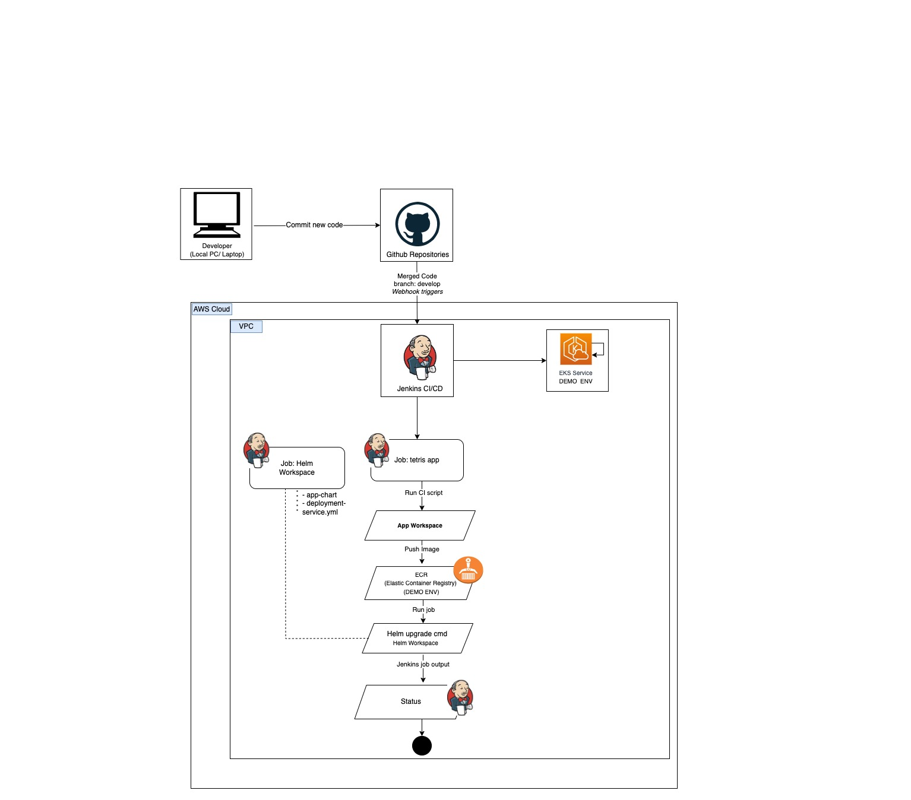</p>

Project Overvew
Welcome to the Kubernetes DevSecOps-Demo AProject! This comprehensive guide will walk you through setting up a robust DevSecOps pipeline on AWS using Kubernetes. The project is designed to deploy a Tetris game application on an EKS Cluster.

Before diving into the project, make sure you have the following prerequisites in place:
1.	Local Environment Setup:
•	Terraform and AWS CLI: Install and configure Terraform and AWS CLI on your local machine. Basic knowledge of these tools is necessary.
•	Basic Knowledge: Ensure basic knowledge of Terraform, AWS CLI, and familiarity with cloud concepts.
2. Jenkins Server Deployment:
•	Git: Basic knowledge of Git commands is required.
•	AWS EC2: Understanding of AWS EC2 instances and security groups.
•	Jenkins Server: Familiarity with Jenkins and understanding of continuous deployment concepts.
3. Jenkins Configuration:
•	Jenkins: Familiarity with Jenkins and basic Jenkins pipeline concepts.
•	Docker, Terraform, Kubectl, AWS CLI: Basic knowledge of these tools is necessary.
5. Pipeline Configuration:
•	Jenkins Plugins: Understanding of Jenkins plugins, especially AWS Credentials, and Pipeline: AWS Steps.
•	Tools Configuration: Basic knowledge of configuring tools like Docker, NodeJS, in Jenkins server.


## Directories 📂

1. **EKS-Cluster:** Explore Terraform scripts for deploying EKS clusters on AWS.
2. **Jenkins-Pipeline-Code:** Jenkins pipeline code for automated CI/CD.
3. **Jenkins-Server:** Terraform scripts for provisioning Jenkins servers on AWS EC2.
4. **helm-chart:** Kubernetes manifest files for Tetris application deployment.
5. **Tetris-V1:** Initial version of the Tetris game application.
6. **Tetris-V2:** Enhanced version of the Tetris game application.

## Getting Started 🚀

1. **Clone the Repository:**
   ```bash
   git clone git@github.com:zicttraining/DevOps-cloud-training-.git
2. **Explore the Directories:**
   Navigate into each directory to find detailed scripts, pipelines, and configurations.

3. **Follow the Blog:**
   Implementation details and insights are documented in the associated [README.md](https://github.com/zicttraining/DevOps-cloud-training-.git).

## Tools Explored 🛠️
1. **Jenkins:** Automated CI/CD pipelines
2. **EKS:** Orchestration for containerized applications
3. **ECR:** Managed container image registry service that is secure, scalable, and reliable.
4. **Docker:** Containerized application deployment
5. **Terraform:** Infrastructure as Code for Jenkins Server, AWS EKS vs ECR.

## Implementation 📝
   To implement this project, follow the step-by-step guide in our detailed [README.md](https://github.com/zicttraining/DevOps-cloud-training-.git). Learn how each tool plays a crucial role in achieving DevSecOps excellence.
   Here, I assume that you already have another Jenkins Server(EC2) and EKS Cluster using Terraform [Jenkins-Server **README.md** Directories, EKS Cluster **README.md** Directories].

   If not EKS Cluster **README.md** Directories. To implement this project, follow the step-by-step guide in our detailed
   ## Configure the Jenkins
   Now, go back to your Jenkins Server terminal and configure the AWS.
   (Input your aws access key, secrect key)

   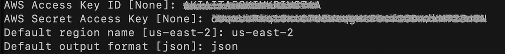
   
   Click on **Manage Jenkins** 
   Select the **Available plugins** and install the following plugins and click on **Install**

   ```
   AWS Credentials
   Pipeline: AWS Steps
   Docker
   Docker Commons
   Docker Pipeline
   Docker API
   docker-build-step
   Eclipse Temurin installer
   NodeJS
   SonarQube Scanner
   ```
   
   Once, both the plugins are installed, restart your Jenkins service.
   Now, we have to set our AWS credentials on Jenkins
   Go to **Manage Plugins** and click on **Credentials**
   
   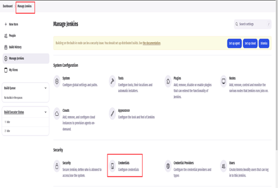

   Click on **global**.
   
   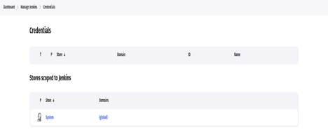
   
   Click on **Add credentials**
   
   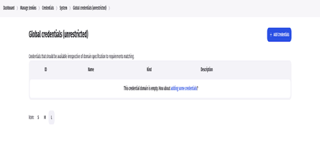

   Select **AWS Credentials** as Kind and add **the ID** same as shown in the below snippet except for your AWS Access Key & Secret Access key and click on **Create**.
   
   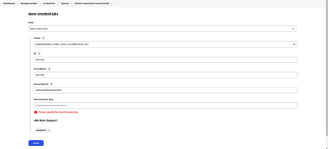

   Now, Go to the **Dashboard** and **click Create a job**
   
   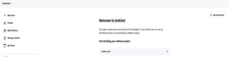

  Select the **Pipeline** and provide the name to your **Jenkins Pipeline** then click on **OK**.
  
  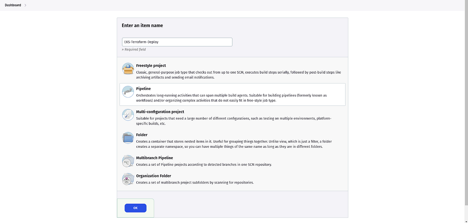
  
  Now, Go to the GitHub Repository in which the Jenkins Pipeline code is located to deploy the EKS service using Terraform.


  After pasting the Jenkinsfile code, click on  **Save & Apply **.
  Click on **Build**
  
   ## Notes: if failure then click Build with Parameters and input File-Name and build again: variables.tfvars -lock=false
   
   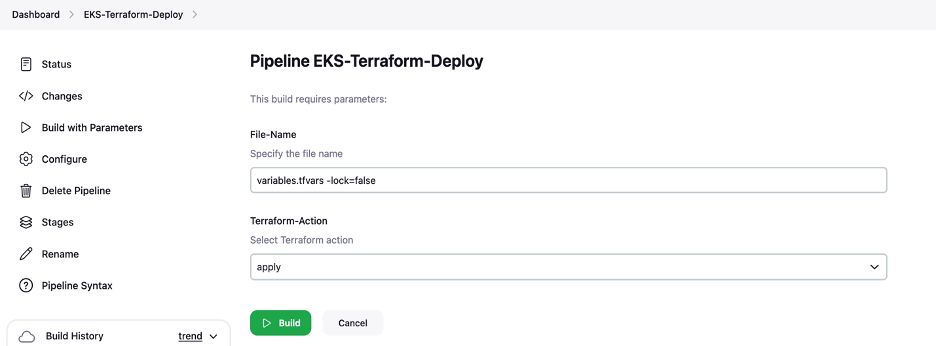

  You can see our **Pipeline**
  Now, we will configure the **EKS Cluster** on the **Jenkins Server**
  Run the below command to configure the EKS Cluster on jenkins server
  Now, connect to your Jenkins-Server by clicking on Connect.
  cd DevOps-Demo/Code/infra_provision/Jenkins-Server
  chmod 400 jenkins-key.pem
  ssh -i "jenkins-key.pem" ubuntu@your public ip
  aws eks update-kubeconfig --region us-west-2 --name Tetris-EKS-Cluster-Demo
  To validate whether the EKS Cluster was successfully configured or not. Run the below command

  ```
  kubectl get nodes
  ```
  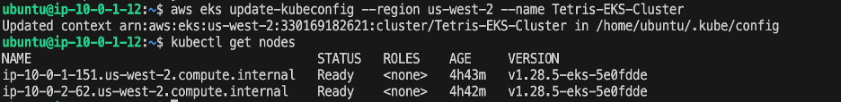

   ## NOTES: The same to deploy the EKS service using Terraform with create other job on jenkins for to deploy the ECR Repositories

   Now, we have to configure the installed plugins.
   Go to **JDashboard**J -> **JManage Jenkins**J -> **JTools**J
   
   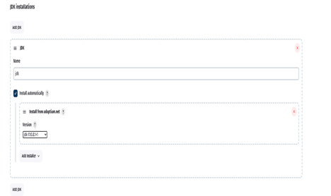

   We are configuring jdk
   Search for jdk and provide the configuration like below snippet.
   
   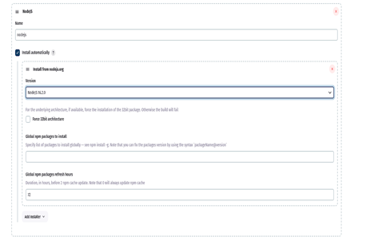


   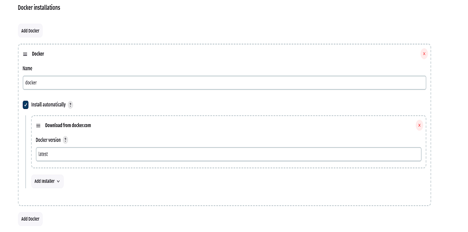

   Now, we will configure Scanner installations
   Search for Scanner and provide the configuration like the below snippet.
   ```
   SonarQube Scanner: sonar-scanner
   SONAR_RUNNER_HOME: /var/lib/jenkins/plugins/sonar/META-INF/maven/org.jenkins-ci.plugins/sonar
   ```
   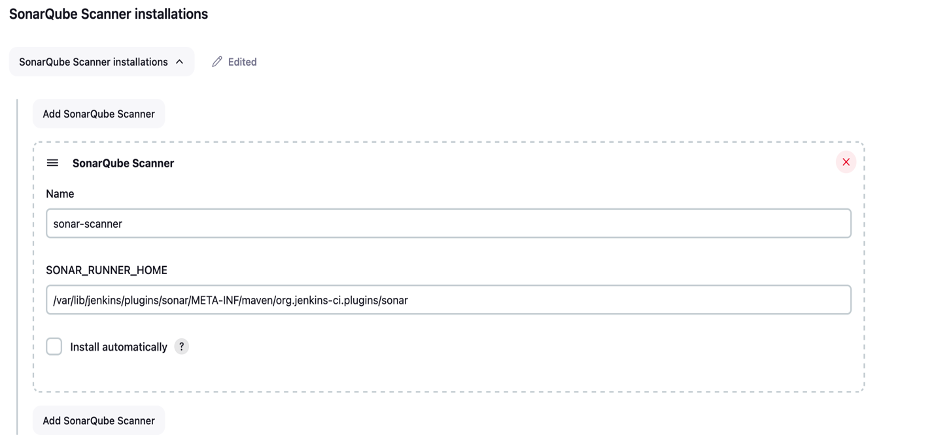

   Go to **Dashboard** -> **Manage Jenkins** -> **Credentials**
   Add your docker hub username and password in the respective field with ID **docker**.

   Click on **Create**
   
   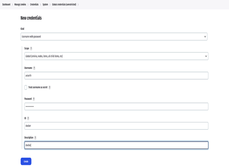

   Add GitHub credentials (github username/password)
   Select the kind as **Secret text** and paste your GitHub Personal access token (your Personal access token) in Secret and keep other things as it is.

   Click on **Create**

   ## Note: If you haven’t generated your token then, you have it generated first then paste it in the Jenkins
   
   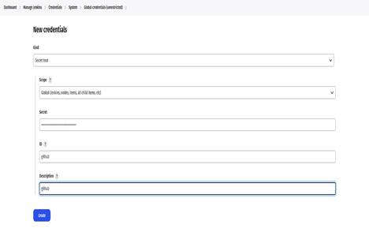

   Now, we are ready to create our Jenkins Pipeline to deploy our 
   Go to **Jenkins Dashboard** 
   Click on **New Item** 
   
   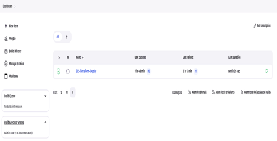
   
   Provide the name of your **Pipeline** and click on **OK**.

   Now, we are ready to create our Jenkins Pipeline to deploy our Tetris Application.
   Now, we are ready to create our Jenkins Pipeline to deploy our Tetris Application.
   Go to **Jenkins Dashboard** 

   Click on **New Item** 
   
   

   Provide the name of your **Pipeline** and click on **OK**.
   
   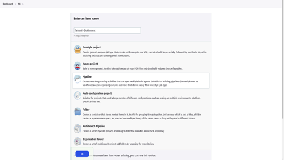

   This is the Jenkinsfile to deploy Tetris Application Version 1 on EKS.
   
   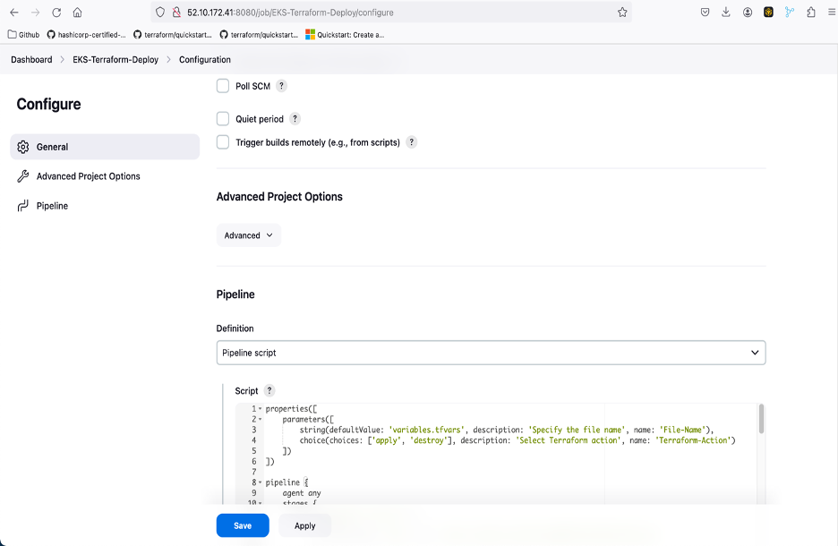

   Now, click on the build.
   Our pipeline was successful.
   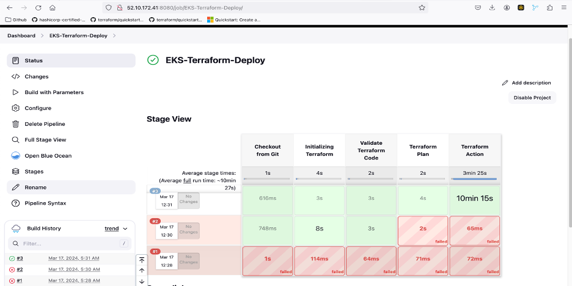

   Copy the DNS name of your load balancer, you can go to AWS Console and copy the Load Balancer and hit the DNS on your favorite browser to enjoy the Tetris Game.
   
   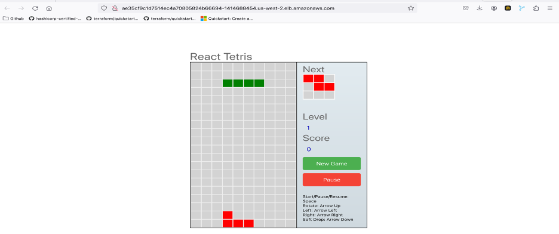

## We will deploy Tetris Application Version 2
   Now, suppose we have done some modifications to our previous version to make it more good in the sense of GUI or anything else. Then, we will have to deploy our Version 2 of our same application.

   To do that, we will create a new pipeline. We can do it in the existing pipeline as well but this way you will be able to understand clearly.
   We have a separate code for our Tetris Version 2. In which Dockerfile is present, so we will build the image and push it on docker and then update the same manifest file instead of v1 we will replace it with v2 manually first.

   **Hope you get the high overview, what are we going to do next?**
   Let’s make it and finish our project.

   Go to **Jenkins** -> **Dashboard** and click on **New item**
   
   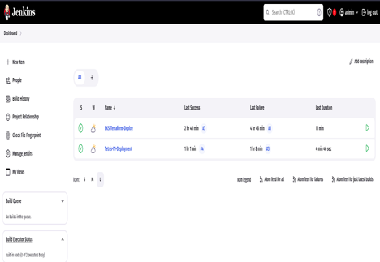

   Provide the name to your **Pipeline name** and click on **OK**.
   
   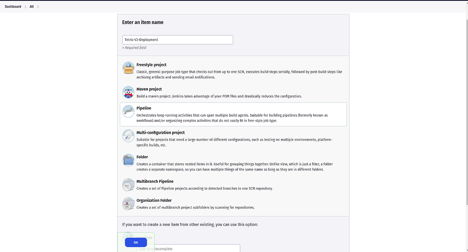
   
   This is the Jenkinsfile to deploy Tetris Application Version 2 on EKS.
   Click **Apply & Save.**
   
   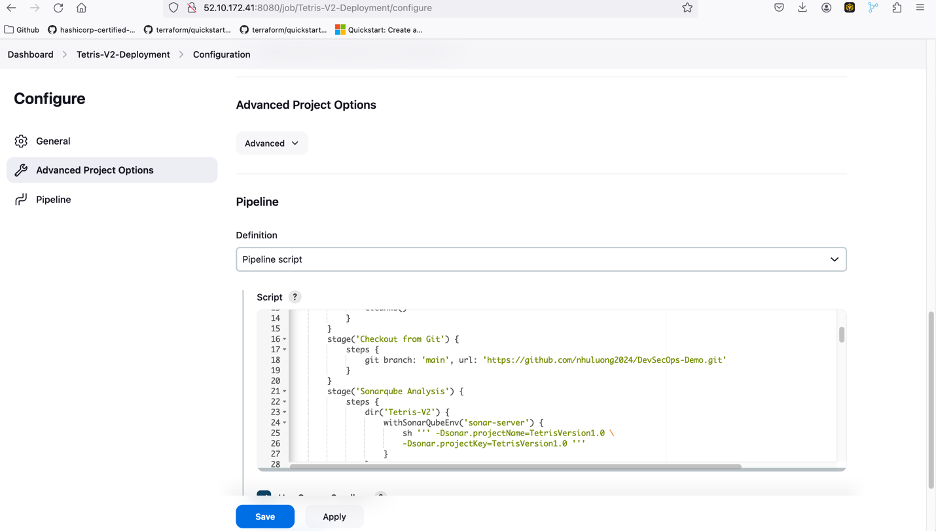

  ## Notes 🙌
  Before going to build the pipeline, update the manifest file.
  Now, Once you click on the build to deploy our Tetris Application Version 2 then commit to gitgub reporsitories
  ```
  Old values: image: nhu.luong/tetrisv1:latest
  Replace new => image: nhu.luong/tetrisv2:latest
  ```
  
  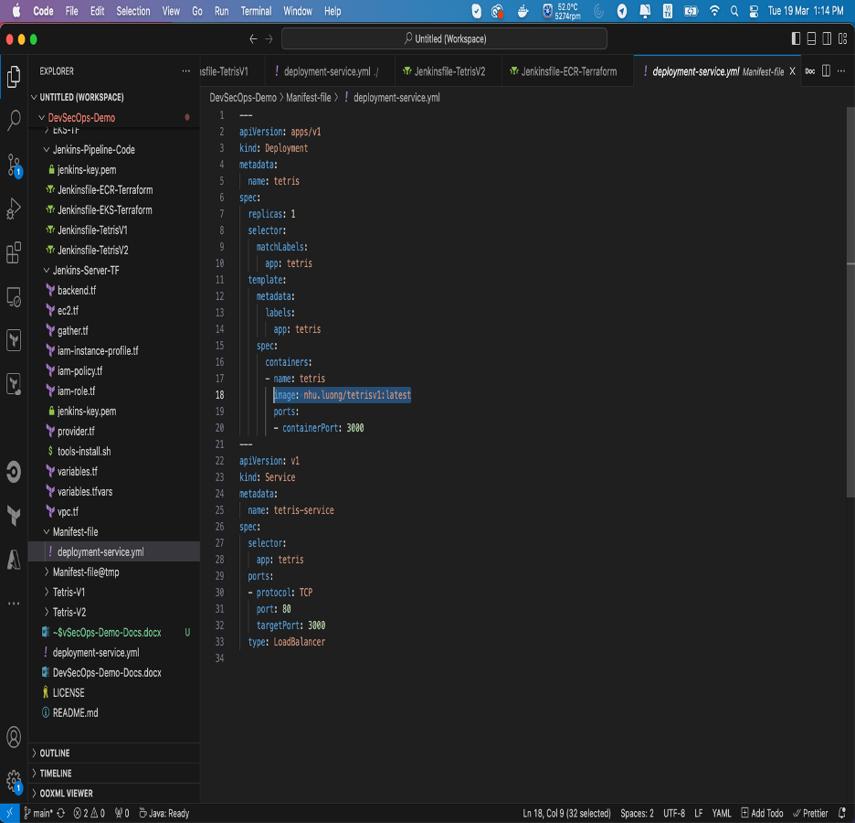

  You will see our **pipeline**
  
  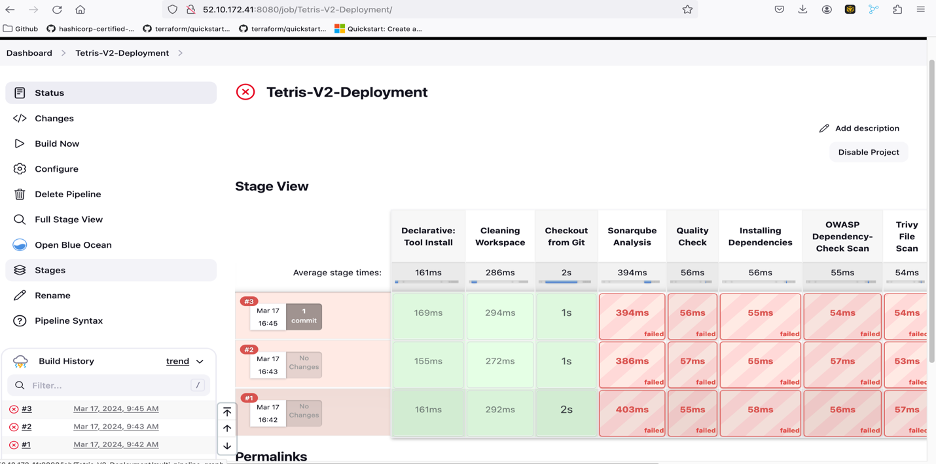
   
   Now, you can enjoy the game.
   
   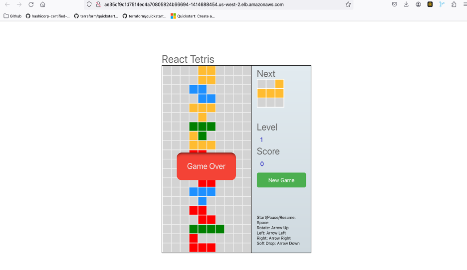

## Cleanup
**We will destroy the created AWS Resources**
Delete both the created LoadBalancer manually.
```
$ cd DevOps-Demo/Code/infra_provision/EKS-Cluster
$ terraform init
$ terraform destroy -var-file=variables.tfvars --auto-approve -lock=false
provider.aws.region
  The region where AWS operations will take place. Examples
  are us-east-1, us-west-2, etc.

  Enter a value: us-west-2
```

Select the **EKS-Terraform-Deploy** Pipeline => if you have run job on jenkins before.

Click on **Build with Parameters** and select the **destroy** and click on **Build**.

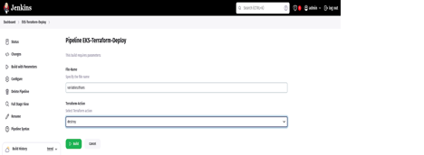

The Pipeline ran successfully which means the EKS Cluster has been deleted.

## Acknowledgments 🙌
   Special thanks to the open-source community and the contributors who make learning and collaboration an incredible journey.

## License 📄
   This project is licensed under the Apache-2.0 license see the [LICENSE](http://www.apache.org/licenses/) file for details.
