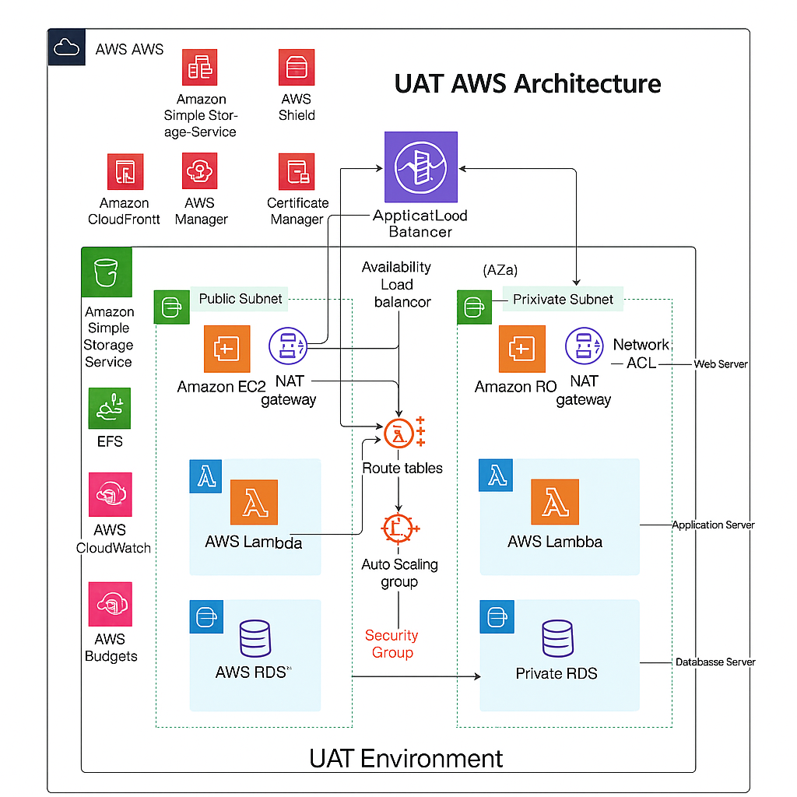

UAT Environment - AWS Infrastructure
Overview
This repository defines and manages the User Acceptance Testing (UAT) environment for our application using Terraform. The UAT environment is architected to closely mirror the Production setup to ensure accurate pre-release testing. It is deployed on AWS for high availability, scalability, and security.

1. Web Tier (Public Subnet)
Amazon EC2: Web servers

Application Load Balancer (ALB): Manages incoming traffic

Amazon CloudFront: Content delivery

Amazon Route 53: DNS routing

NAT Gateway: Enables secure internet access from private subnets

2. Application Tier (Private Subnet)
Amazon EC2 & AWS Lambda: Backend processing

Amazon S3, EFS: Static asset storage and shared volumes

Amazon Secrets Manager: Secure secrets storage

3. Database Tier (Private Subnet)
Amazon RDS (Multi-AZ): Managed database services

4. Security and Monitoring
Security Groups / NACLs: Controlled access

IAM Roles / Policies: Access management

CloudWatch / CloudTrail / GuardDuty: Monitoring and auditing

AWS Shield: DDoS protection

⚙️ Terraform Deployment
📁 Directory Layout
bash
Copy
Edit
terraform/
├── envs/
│   └── uat/
│       ├── main.tf
│       ├── variables.tf
│       ├── outputs.tf
│       └── backend.tf
├── modules/
│   ├── vpc/
│   ├── ec2/
│   ├── rds/
│   ├── alb/
│   └── lambda/
🚀 Steps to Deploy
Prerequisites:

Terraform v1.3+

AWS CLI configured with UAT credentials

S3 bucket + DynamoDB table for backend state

bash
Copy
Edit
cd terraform/envs/uat

# Initialize modules and remote backend
terraform init

# Preview planned changes
terraform plan -var-file="uat.tfvars"

# Apply the infrastructure
terraform apply -var-file="uat.tfvars"
🔒 Security Practices
IAM roles with least-privilege access

All secrets managed by AWS Secrets Manager

Traffic isolated using private subnets for Lambda, RDS, and app servers

All data access and network activity logged via CloudTrail and VPC flow logs

✅ Features
Multi-AZ deployment for HA

Auto-scaling of EC2 instances

ALB and CloudFront for optimized delivery

Fully isolated from Dev and Prod via subnet segmentation and tagging

S3 buckets and EFS volumes mounted as needed

Cost tracking via Environment=UAT tags

📌 Next Steps
 CI/CD pipeline for Terraform automation

 WAF integration for application firewall

 Data masking for test data compliance

🔗 Resources
Terraform Docs

AWS Well-Architected Framework

CloudFront with ALB Integration Guide